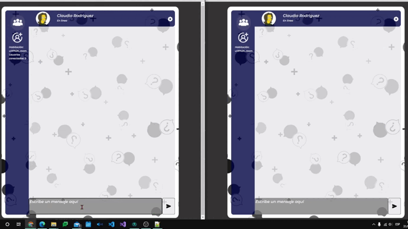

# ECV

Pagina web emula un chat. Hecha en la asignatura entorns de comunicació virtual. El server se aloja en [Link](https://ecv-etic.upf.edu/)

Click: 
- imagen de arriba de muchas personas te conectas a la sala general
- imagen persona con +: creas usuario con quien hablar
- usuario creado: ves solo los mensajes enviados a ese usuario, si haces click a oro veras los del otro usuario
- configuración (boton derecha horizontal bar): cambias la room o tu nombre de usuario

Textarea
Shift+Enter: salto de linea
Enter solo con nada: no envia salto de linea
Enter: envia, con contenido
Supr: Elimina todos los mensajes
Apretar más de una vez Enter sin contenido: limpia textarea
escribir ':' y apretar 'control' después: emoji

Botón send: envia mensaje con contenido. 

Si estas escribiendo arriba sale escribiendo y si estas sin escribir sale en linea. 

Si envias aun usuario en particular, en el server estas enviando el mensaje al usuario en particular en la room elegida. 

Si clicas en textarea se actualiza la información de usuarios conectados en la room. La información de que room estamos se
actualiza cuando la cambiamos en configuración como el nombre de usuario. 

Si pasas el cursor por la barra vertical se ven los nombres de usuario. 

## Demo

 
